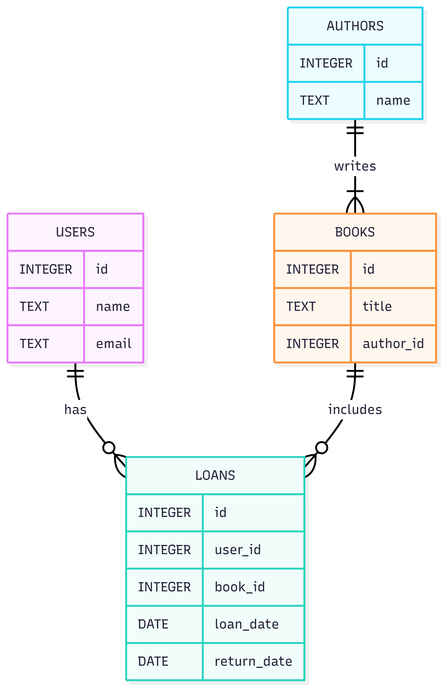

# DESIGN.md — Library Manager Database

## Project Title
**Library Manager**
---
name : samira mashti zadeh
edx username : samira-dev-star
github username : samira-dev-star

email : sammashtizadeh@gmail.com

location : Ahvaz, khuzestan province, Iran
today is : Aug. 29 2025
---

## Purpose
The purpose of this project is to design and implement a relational database for managing a digital library system. The database will allow users to:

- Search for books
- View author information
- Borrow books
- Track loan history

This system is intended to streamline library operations and provide users with an intuitive way to interact with library resources.

---

## Scope
The database will support the following core functionalities:

- Store information about books and their authors
- Manage user accounts and contact information
- Track book loans, including loan and return dates
- Enable search functionality based on book titles and author names

This project is designed for a single-user implementation but can be scaled to support multiple users and administrative roles in future iterations.

---

## Entities and Relationships

### Entities:
- **Authors**: Each author has a unique ID and a name.
- **Books**: Each book has a unique ID, title, and is associated with one author.
- **Users**: Each user has a unique ID, name, and email.
- **Loans**: Each loan record links a user to a book, with loan and return dates.

### Relationships:
- One author can write many books (1:N)
- One user can borrow many books (1:N)
- Each loan connects one user to one book (N:1)

---

## Entity Relationship Diagram

*Note: Replace with actual diagram image filename once created.*

---

## Design Choices

- **Normalization**: The database is normalized to 3NF to reduce redundancy and improve data integrity.
- **Foreign Keys**: Used to enforce relationships between tables (e.g., `author_id` in `books`, `user_id` and `book_id` in `loans`).
- **Indexes**: Indexes are created on `title` in `books` and `name` in `authors` to optimize search queries.
- **Constraints**: Unique constraints on `email` in `users` to prevent duplicate accounts.

---

## Optimizations

- **Search Efficiency**: Indexes on frequently queried fields improve performance.
- **Data Integrity**: Foreign key constraints ensure valid relationships between entities.
- **Scalability**: The schema is designed to be extensible, allowing future additions like genres, multiple authors per book, or user roles.

---

## Limitations

- Each book is currently associated with only one author.
- No support for overdue tracking or fines.
- No administrative interface or authentication layer.
- No support for multiple copies of the same book.

---

## Future Improvements

- Add support for multiple authors per book via a junction table.
- Implement overdue tracking and notifications.
- Add genres, publishers, and book reviews.
- Create a web interface for users and librarians.

---

## Video Overview
YouTube Video URL : https://youtu.be/Z2M59WAXEoQ?si=IlSBgDfHQrqB-MFA

### The video includes:
- Project title and author introduction
- ER diagram walkthrough
- Schema and query demonstration
- Summary of design decisions
